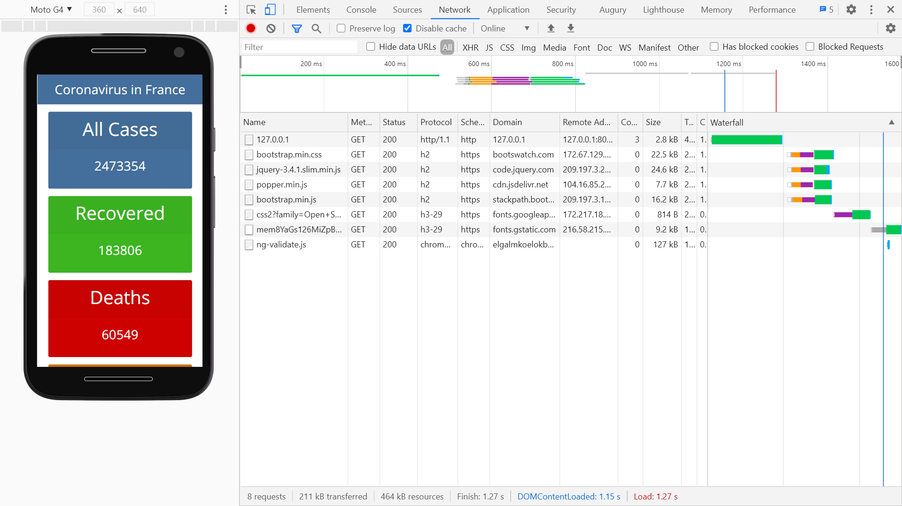

# :zap: Python Django Site

* Python-Django app to display Covid data
* Code from a tutorial by [TopNotch Programmer](https://www.youtube.com/channel/UCO5WiowKFnEw17AOk008WOQ) - see [:clap: Inspiration](#clap-inspiration) below

## :page_facing_up: Table of contents

* [:zap: Python Django Site](#zap-python-django-site)
  * [:page_facing_up: Table of contents](#page_facing_up-table-of-contents)
  * [:books: General info](#books-general-info)
  * [:camera: Screenshots](#camera-screenshots)
  * [:signal_strength: Technologies](#signal_strength-technologies)
  * [:floppy_disk: Setup](#floppy_disk-setup)
  * [:computer: Code Examples](#computer-code-examples)
  * [:cool: Features](#cool-features)
  * [:clipboard: Status & To-do list](#clipboard-status--to-do-list)
  * [:clap: Inspiration](#clap-inspiration)
  * [:envelope: Contact](#envelope-contact)

## :books: General info

* Displays Covid data from a [Covid-19 API](https://rapidapi.com/api-sports/api/covid-193/endpoints)

## :camera: Screenshots



## :signal_strength: Technologies

* [Python v3](https://www.python.org/) programming language
* [Django v3](https://www.djangoproject.com/) server-side web framework
* [Bootstrap v4](https://getbootstrap.com/)
* [Bootswatch v4](https://bootswatch.com/) Bootstrap themes - Spacelab theme used

## :floppy_disk: Setup

* [Install Python](https://docs.python-guide.org/starting/installation/)
* [Install pip](https://docs.python-guide.org/dev/virtualenvs/#installing-pipenv)
* [Install Django](https://docs.djangoproject.com/en/3.1/howto/windows/) by typing `pip install Django`
* Run `django-admin startproject example_proj` to create a new project [ref. docs](https://docs.djangoproject.com/en/3.1/intro/tutorial01/)
* Open `example_proj` in VS Code
* Run `python manage.py startapp new_module` to create Python module
* Add code
* Run `pip freeze` to see list of modules installed. [Ref. Docs](https://pip.pypa.io/en/stable/reference/pip_freeze/)
* Run `python manage.py makemigrations` for changes to models etc.
* Run `python manage.py migrate` to migrate the migration files.
* For Admin panel: to add a superuser Run `python manage.py createsuperuser --username=joe --email=joe@example.com` [Ref. Docs](https://docs.djangoproject.com/en/3.1/topics/auth/default/)
* Run `python manage.py runserver` to run server on port 8000 and open /admin console

## :computer: Code Examples

* extract from `views.py` to get Covid data from API and prepare data required for html template

```python
def home(request):
    url = "https://covid-193.p.rapidapi.com/statistics"
    querystring = {"country":"France"}
    headers = {
        'x-rapidapi-key': "a6f5f5daa9msh415e131fbb7e735p1994d1jsnb2bc491b075e",
        'x-rapidapi-host': "covid-193.p.rapidapi.com"
        }
    response = requests.request("GET", url, headers=headers, params=querystring).json()
    data = response['response']
    d = data[0]
    print(d)
    context = {
      'country': d['country'],
      'all': d['cases']['total'],
      'recovered': d['cases']['recovered'],
      'deaths': d['deaths']['total'],
      'new': d['cases']['new'],
      'critical': d['cases']['critical'],
      'date': d['day']
    }
    return render(request, 'index.html', context)
```

## :cool: Features

* [Bootswatch v4](https://bootswatch.com/) makes it very easy to change themes

## :clipboard: Status & To-do list

* Status: Working
* To-do: Add commas to numbers. Move API code to services, add country pull-down selector.

## :clap: Inspiration

* [How to build a Covid19 tracker/statistics app with PYTHON and Django](https://www.youtube.com/watch?v=XplnlmIgebM&t=430s)

## :envelope: Contact

* Repo created by [ABateman](https://www.andrewbateman.org) - you are welcome to [send me a message](https://andrewbateman.org/contact)
